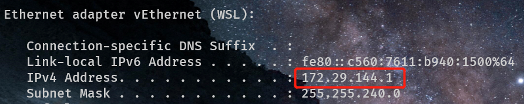

!!!	This... This is mainly for users in Mainland China, so it's writen in Chinese.
# STEP1 打开WSA

# STEP2 找到WSA局域网中主机的IP


冷知识：WSL和WSA都用这个虚拟网卡。

# STEP3 ADB设置代理
powershell中运行：
```powershell
adb shell settings put global https_proxy {第二步的结果}:{你的端口}
adb shell settings put global http_proxy  {第二步的结果}:{你的端口}
```
# STEP4 设置Clash for Windows


确保Allow Lan，TUN Mode都打开。TUN Mode需要提前安装Service Mode，绿色小地球代表服务已安装并且正常运行。

# 结果

可以看见Dua Lipa耍宝，成功。